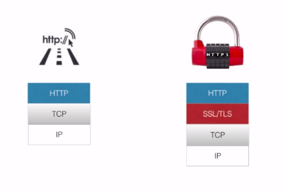

课程地址：[进击 Node.js 基础（二）](https://www.imooc.com/learn/637)

> Node.js 是一个 Javascript 运行环境(runtime)。实际上它是对 Google V8 引擎进行了封装。V8 引 擎执行 Javascript 的速度非常快，性能非常好。Node.js 对一些特殊用例进行了优化，提供了替代的 API，使得 V8 在非浏览器环境下运行得更好。[1] Node.js 是一个基于 Chrome JavaScript 运行时建立的平台， 用于方便地搭建响应速度快、易于扩展的网络应用。Node.js 使用事件驱动， 非阻塞 I/O 模型而得以轻量和高效，非常适合在分布式设备上运行的数据密集型的实时应用。Power By Baike_Baidu

## 传统动画方式控制函数回调流程

代码地址：node2-imooc/promise/ball.html

tips:

- 坑：小球差点没动起来，原来是 parseInt 的时候把单位去掉了，加上"px"就可以啦，代码里面有详解,小段逻辑代码解释

```
cb && cb()
```

先检查 cb 存不存在，如果不存在就不必执行 cb()了，如果存在会执行该方法。

## Promise 控制函数回调流程

代码地址：node2-imooc/promise/promiseBall.html

<!-- `npm install bluebird`安装 bluebird 库 -->

- node7.X 以后，内置了 promise 对象，已经不用在引入其他模块了

* ES6 语法中已经有了 Promise,所以不需要 bluebird.js
* 函数前面加上下划线"\_"表示是私有函数

- margin-left:0，样式要写成内联样式，不然无法通过 ball.style.marginLeft 获取到值。

* 程序流程很清楚非常好看，但是其实并不是 then 后面就开始执行的

## Promise

1. ES6 的 Promise 语言标准
   > ES6 是什么，与 JS 的关系？
   > ECMAScript 是 JavaScript 语言的国际标准，JavaScript 是 ECMAScript 的实现。ES6 的目标，是使 JavaScript 语言可以用来编写大型的复杂的应用程序，成为企业级开发语言。
   > ECMAScript 和 JavaScript 的关系是，前者是后者的规格，后者是前者的一种实现
   > [【ES6】var、let、const 三者的区别]("https://blog.csdn.net/unionz/article/details/80032048")
2. Promise/A+规范
   Promise A 与 A+ 不同点

- A+ 规范通过术语 thenable 来区分 promis 对象
- A+ 定义 onFulfilled/onRejected 必须是作为函数来调用，而且调用过程必须是异步的
- A+严格定义了 then 方法链式调用时， onFulilled/onRejected 的调用顺序

3. promise 首先是一个对象然后是一种安装规范
4. promise 对象的三种状态

- 未完成(pending)
- 已完成(fulfilled))
- 未完成(rejected)
  > 1. Promise 没有把异步变同步，只是以同步的方式来写异步，使用 promise，当代码执行到 resolve 时跳到下一步的 then 方法中依次执行，执行到 reject 时跳到 catch 方法依次执行；
  > 2. 上一步 then 方法中返回的值可以是一个新的 Promise 也可以是某一固定值，为新的 Promise 时据其 resolve 和 reject 来进行下一步的代码执行，当为固定值时会把该值传给下一步的 then 方法参用。Ajax 解决的是网页异步刷新问题，完全可以在 Promise 中嵌套使用 ajax。

## Promise 使用场景

1. 是一种异步的实践方案
2. 特别是 Callback Hell, 可以用同步的方式写异步代码

## HTTP 和 HTTPS 协议

https 的代码写法：node2-imooc/promise/https.js



- https 协议是在 http 协议的基础上添加了 SSL 和 TLS

* https 模块主要是处理加密访问的。搭建 https 的时候需要 ssl 证书。

* 并发控制，同时去爬 Promise.all();

## promise 化的爬虫项目(const 和 var 的区别是什么？)

node2-imooc/promise/promise_crawler.js

- 基础的 cherrio 取值然后用 promise 的函数去简化流程什么的基本搞清楚了，但是取 ajax 的值还是没有搞清楚，花了太多的时间了

* Promise.all 方法可以接受一个数组

- promise 的实例对象传入回调函数，请求完成的时候，把 html 通过 resolve 返回或者说传递。有 error 的时候用 reject

### 遇到的坑

每个 Promise 对象中发起两个 https 请求，分别用来获取该课程的学习人数和课程的章节信息的 HTML 代码。最后将学习人数和原网页代码一并交给 resolve()进一步处理。

原文: https://niuyi1017.github.io/2018/09/10/http-crawler.html

坑 1： 人数是用 ajax 获取的普通的 url 是得不到的，代码看的[别人的](https://niuyi1017.github.io/2018/09/10/http-crawler.html)表示我这里还没搞清楚

坑 2：慕课网现在用 https 协议了，不是课程中的 HTTP

#### promise 写的爬虫项目巨型大坑

##### 大型 bug

```bash
(node:36099) UnhandledPromiseRejectionWarning: TypeError: Cannot read property 'parent' of undefined
```

<strong>resolve 函数传值传两个值的时候一定要加上{},不然的话会出现 bug</strong>
`resolve({html, Lnumber});`

## 以下内容建议和[廖雪峰的 JS 教程](https://www.liaoxuefeng.com/wiki/001434446689867b27157e896e74d51a89c25cc8b43bdb3000/001434501497361a4e77c055f5c4a8da2d5a1868df36ad1000)同看

## net 模块，网络的基础就是数据的传输和处理

所以要讲 buffer 和 stream

### Buffer(可以处理 TCP、图像、文件、网络)保存原始数据

Buffer 在 nodejs 中用来处理二进制的数组（js 字符串是用 utf-8 存储的，处理二进制的能力是很弱的，而网络层对资源的请求，响应等基本以二进制来进行交互）创建一个专门存储二进制的缓存区，并提供了一些方法对这些缓存区的数据做进一步的处理。buffer 在 nodejs 里可全局访问。
代码：node2-imooc/buffer/buffer_image.js

#### node.js 文件系统

1. fs 是用来操作文件的重要 API，可以实现读取文件，写入文件，复制文件，删除文件等功能！
2. fs 模块都支持异步和同步的方法
3. fs.writeFile()的参数依次为文件名、数据和回调函数。如果传入的数据是 String，默认按 UTF-8 编码写入文本文件，如果传入的参数是 Buffer，则写入的是二进制文件。回调函数由于只关心成功与否，因此只需要一个 err 参数。

- buffer 最开始的大小已经被制定了，重新写入只会覆盖原先的值，多出来的也不好显示

* buffer.toString()才能把写入的 buffer 读取出来

- buffer.copy(target, tStart, sStart, sEnd=buffer.lenght)
  tStart 目标 buffer 中从第几个字节开始写，默认 0
  sStart 原 buffer 中开始复制的位置。默认 0
  sEnd=buffer.lenght 从复制源 buffer 中复制结束的位置

### Stream 暂存和移动数据

### Steam 种类

1. readable 可读流
   获取数据
2. Writable 可写流
   消费数据
3. Duplex
   即可接受又可消费
4. Transform
   只是不保存数据，也是双工

#### request 模块，对 stream 流的封装，pipe 一下简直太爽了

代码：node2-imooc/stream/request_logo.js
`npm install request`，打开http://localhost:8090/
加载 request 模块之后，request 数据地址然后直接 pipe 给 res
可以实现边下载边 pipe,

- pipe 方法自动帮忙监听 data 和 end 事件，
  源源不断的把数据发送给客户端
- pipe 方法还可以自动控制后端压力，
  连接缓慢的时候 node 可以将尽可能少的缓存放在服务器自动控制流量

#### pipe 大法好，用 pipe 把可读流和可写流连接起来

代码：node2-imooc/stream/pipestream_write_read.js
自己挖的坑：`readStream.push(null);`可读流结束的时候需要加上 null，
但是我愚蠢的把 null 加上了''，变成了字符串，导致可读流不能终止

#### 数据流的定制

> 介绍了 pipe 工作流程（最不懂的地方是.call(this);是什么意思？）

实现定制的可读流，可写流，转换流，实现内置的接口
代码：node2-imooc/stream/custom_stream.js
与代码：node2-imooc/stream/pipestream_write_read.js 可以进行对比
在此基础上面进行定制

#### 数据流的复制

代码：node2-imooc/stream/stream_copy_logo.js

#### 数据流的过程

代码：node2-imooc/stream/stream_event.js
看整个 steam 的传递过程触发了多少次 data 事件，以及在 data 事件中流的暂停和流的重启

#### 数据流的读写和搬运

代码： node2-imooc/stream/read_write_stream.js
中有防止爆仓处理
